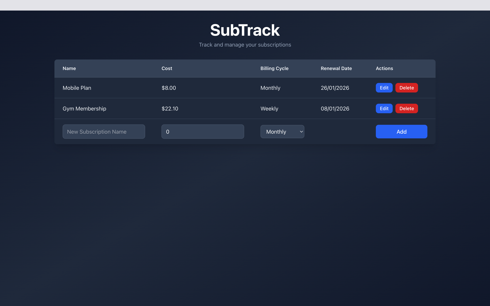

# SubTrack



SubTrack is a full-stack subscription tracking application designed to help users manage their recurring expenses efficiently. It features a high-performance **ASP.NET Core Web API** backend with smart renewal logic and a modern, interactive **React (TypeScript)** frontend.

## ✨ Key Features

### 🚀 Backend (API)
* **Smart Renewal Logic**: Automatically calculates and updates the next renewal date when a subscription's billing cycle changes.
* **Flexible Billing Cycles**: Native support for **Weekly**, **Monthly**, and **Yearly** billing cycles with automated date math.
* **Full CRUD Operations**: Create, Read, Update, and Delete subscriptions via a RESTful API.
* **Persistent Storage**: Reliable data persistence using **SQLite** and **Entity Framework Core**.
* **OpenAPI Integration**: Built-in Swagger UI for interactive API documentation and testing.

### 💻 Frontend (Client)
* **Interactive Dashboard**: View all subscriptions in a clean, responsive table.
* **Inline Editing**: Update subscription details (Name, Cost, Billing Cycle) directly within the list without navigating away.
* **Quick Add**: Rapidly create new subscriptions using the integrated form row at the bottom of the list.
* **Input Validation**: Client-side protection prevents empty names or negative costs from being submitted.
* **Visual Feedback**: Real-time updates for costs and formatted renewal dates.

## 🛠 Tech Stack

### Server
* **Framework**: .NET 10.0 (ASP.NET Core Minimal APIs)
* **Database**: SQLite (`Microsoft.EntityFrameworkCore.Sqlite`)
* **ORM**: Entity Framework Core
* **Containerization**: Docker
* **Documentation**: NSwag / Swagger UI

### Client
* **Framework**: React 19
* **Language**: TypeScript
* **Build Tool**: Vite
* **Styling**: Tailwind CSS
* **Server**: Nginx (Production Docker build)

## 🐳 Running with Docker (Recommended)

The easiest way to run the application is using Docker Compose. This will set up both the backend and frontend containers along with a persistent volume for the database.

1.  **Clone the repository**
    ```bash
    git clone [https://github.com/imran-salim/subtrack.git](https://github.com/imran-salim/subtrack.git)
    cd SubTrack/
    ```

2.  **Run the application**
    ```bash
    docker compose up --build
    ```

3.  **Access the App**
    * **Frontend**: [http://localhost:5173](http://localhost:5173)
    * **Backend API**: [http://localhost:5123/subs](http://localhost:5123/subs)

## 🔧 Manual Development Setup

If you prefer to run the services individually for development:

### Prerequisites
* [.NET 10.0 SDK](https://dotnet.microsoft.com/download) or later
* [Node.js](https://nodejs.org/) (version 18+ recommended)

#### Linux
On Arch Linux derivatives (Manjaro, endeavourOS, SteamOS), you will need to install .NET, along with the ASP.NET runtime and the Entity Framework tools. Install these with:
```bash
sudo pacman -S dotnet-sdk aspnet-targeting-pack aspnet-runtime
dotnet tool install dotnet-ef
```

### 1. Backend Setup
The backend must be running for the client to fetch data.

* **Navigate to Backend:**
    ```bash
    cd Backend
    ```
* **Restore dependencies and setup database:**
    ```bash
    dotnet restore
    dotnet ef database update
    ```
* **Run the API:**
    ```bash
    dotnet run
    ```
* The API will start at `http://localhost:5123`.

### 2. Client Setup
Open a new terminal window and navigate to the `Frontend` directory.

* **Install dependencies:**
    ```bash
    cd Frontend
    npm install
    ```
* **Run the development server:**
    ```bash
    npm run dev
    ```
* The application will be available at `http://localhost:5173`.

## 📡 API Endpoints

The API is configured to allow CORS requests from `http://localhost:5173`.

| Method | Endpoint       | Description                                                 |
| :----- | :------------- | :---------------------------------------------------------- |
| `GET`  | `/`            | Returns the API name ("SubTrack API").           |
| `GET`  | `/subs`        | Retrieves a list of all subscriptions.           |
| `GET`  | `/subs/{id}`   | Retrieves a single subscription by its ID.       |
| `POST` | `/subs`        | Creates a new subscription with auto-calculated renewal. |
| `PUT`  | `/subs/{id}`   | Updates a subscription (recalculates renewal if cycle changes). |
| `DELETE`| `/subs/{id}`  | Deletes a subscription by its ID.                |

### Data Models

**Subscription Object**
```json
{
  "id": 1,
  "name": "Netflix",
  "cost": 15.99,
  "cycle": 1,
  "renewalDate": "2025-12-25T00:00:00"
}
```

* `cycle` values: `0` (Weekly), `1` (Monthly), `2` (Yearly).

### License
This project is licensed under the MIT License - see the LICENSE file for details.
